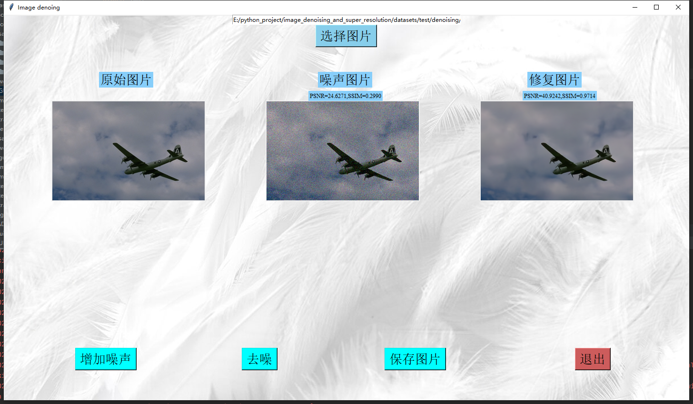

## Image Denoising and Super-resolution based on Tensorflow

# Denoising

- `model`: U-Net
- `datasets`:
  - `training` BSD400/DIV2K/WaterlooED
  - `testing` BSD68/Kodak/McMaster/Urban100

# Super-resolution

- `model`: EDSR/WDSR
- `datasets`:
  - `training` DIV2K
  - `testing` Set5/Set14/DSD100/Urban100

**Acknowledgment:**
This code of super-resolution is based on the 
https://github.com/krasserm/super-resolution.

# GUI

GUI code is based on `tkinter` python lib.

